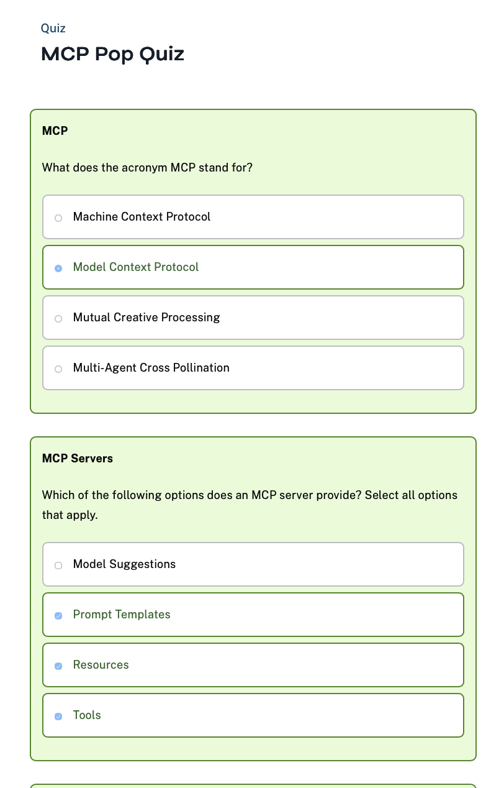
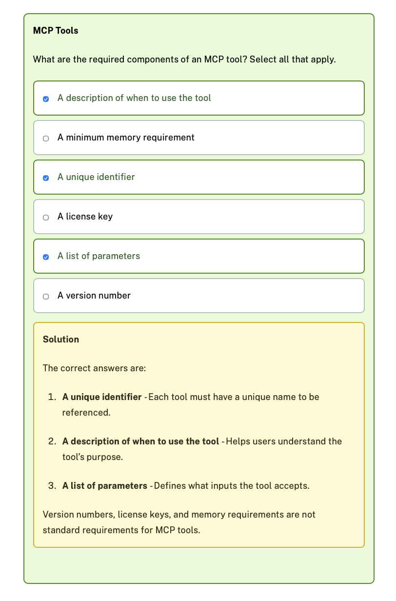

# What is MCP?

https://github.com/neo4j-contrib/mcp-neo4j/tree/main/servers/mcp-neo4j-data-modeling

The** **[Model Context Protocol](https://modelcontextprotocol.org/), commonly referred to as MCP, is an open protocol developed by** **[Anthropic](https://anthropic.com/) that enables AI agents and assistants to access tools and resources in a standardized way.

Before you learn more about MCP, it is important to understand the concept of an** ** **Agent** .

## What are Agents?

There are many definitions of an Agent, but for the context of this course, an Agent is a system that** ** **acts independently** , using tool calling to access information and take actions to** ** **achieve a specific goal** .

A common framework for building agents is the** ****ReAct** framework (Reason/Act). When a ReAct agent receives an input, it follows a continuous loop of** ** **planning** ,** ** **reasoning** , and** ****acting** until the goal is achieved.

The process begins with** ** **planning** , where the LLM analyzes the task, breaks it down into sub-tasks, extracts required information and parameters, and may gain additional details from the user. During this phase, the agent determines what tools will be needed and in what sequence they should be called.

Next comes** ** **reasoning** , where the LLM uses the descriptions of available tools to select the correct tool(s) for each sub-task. The agent evaluates which tools are most appropriate based on the current context and requirements.

Finally, the agent** ****acts** by calling the selected tools, either in sequence or in parallel, to gather information and perform the necessary actions. The results from these tool calls are then fed back into the planning phase, creating a continuous loop where the agent refines its approach based on new information.

For example, consider a smart home automation agent, that uses the weather forecast combined with local temperature sensor data to adjust the blinds and turn on an air conditioning unit.

## Where does MCP fit in?

While agents may have access to tools written directly into their codebase, MCP provides a standardized way for the agent to consume tools built by third parties. An agent could be configured to access a weather API service hosted in the cloud, or connect to a local database tool running on the same machine through Standard Input/Output (stdio).

## Architecture

The MCP protocol consists of the following elements:

* Servers
* Clients
* Hosts

### Servers

The protocol follows a client-server architecture, similar to microservices, where** ****Servers** provide capabilities through a list of** ** **tools** . Each tool that the server hosts has additional metadata assigned to it, including a unique identifier, a description of when that tool can be used, and a list of parameters that the tool can receive. Servers describe the parameters that the tool can receive, and the expected output of the tool.

Along with tools, servers provide access to** ** **Resources** , read-only data that can be consumed by the client. Each resource has its own unique URI, similar to an endpoint in a REST API, and can be used to provide direct access to specific objects with a fixed location.

MCP tools can also provide** ** **Prompt templates** , allowing the client to use pre-written prompts that follow best practices.

### Clients

A** ****Client** is responsible for managing a one-to-one connection to a server.

When a client starts, it will connect to a server, and request a list of tools, resources, and prompt templates that the server provides access to.

This is a** ** **stateful connection** , meaning the client maintains an ongoing connection to the server throughout its lifecycle. The connection can be established using different transport methods:

* **stdio** - The client starts the server locally and communicates through standard input/output streams
* **HTTP** - The client connects to a remotely hosted server using HTTP Server Sent Events (SSE) or HTTP streaming

You will learn more about transport methods in the next lesson.

### Hosts

One or more clients are managed by a** ** **Host** , an application or piece of software that maintains session state and context.

An example of a host may be Claude Desktop, Amazon Q, VS Code, or Cursor. Your agent applications are also examples of an MCP host.

The host determines which tool to use and provides the appropriate parameters to the tool. The client then executes the tool on behalf of the host.

### Tools

Each tool will have a unique identifier, a description of when that tool can be used, and a list of parameters that the tool can receive.

For example, a tool for searching the web may be defined as:

* **id** : search-web
* **description** : Search the web for information
* **parameters** : query, a string

Tools can output a result as text or return Base-64 encoded images.

## ou have passed this lesson!

The Model Context Protocol (MCP) consists of several key elements:

* **Servers** - Provide capabilities through tools, resources, and prompt templates in a client-server architecture
* **Clients** - Manage one-to-one connections to servers and request available tools, resources, and prompt templates
* **Hosts** - Applications (like Claude Desktop, Amazon Q, or Cursor) that maintain session state, manage clients, and decide which tools to use

In the next lesson, you will learn how to install your first MCP server.

## Lesson summary

In this lesson, you learned:

* **Agents** are systems that act independently to achieve specific goals, often using the ReAct framework (reasoning and acting with tools)
* **MCP (Model Context Protocol)** provides a standardized way for agents to consume tools from external providers
* **MCP Architecture** consists of four key components:
  * **Servers** provide capabilities through tools, resources, and prompt templates
  * **Clients** manage one-to-one connections to servers
  * **Hosts** (like Claude Desktop) manage clients and decide which tools to use
  * **Tools** have unique identifiers, descriptions, and parameters
* **Real-world usage** involves configuring hosts to connect to MCP servers for enhanced functionality

You can find more information about these terms at** **[modelcontextprotocol.io](https://modelcontextprotocol.io/).

# Summary & Next Steps

Congratulations! You’ve completed this comprehensive journey through the Model Context Protocol (MCP) and Neo4j’s powerful MCP tools. Let’s take a moment to reflect on what you’ve learned and explore where to go next.

## The Future of Development is Here

The Model Context Protocol (MCP) represents a significant advancement in how developers can build AI applications. It provides a standardized way to connect AI systems with external tools and data sources.

 **The Developer’s Role** : MCP enables developers to create AI applications that can access and interact with various data sources and tools. This requires understanding both AI systems and the tools they need to interact with.

 **Integration Simplification** : MCP reduces the complexity of integrating multiple APIs and data sources. Instead of writing custom integrations for each service, developers can use standardized MCP servers to connect AI applications with external resources.

 **Agent-Based Systems** : MCP supports the development of AI agents that can perform complex workflows by accessing multiple tools and data sources. These agents can execute tasks that require coordination across different systems.

 **Graph-Powered Intelligence** : Knowledge graphs and GraphRAG provide practical ways to enhance AI applications with structured knowledge. Neo4j’s graph database capabilities combined with MCP enable developers to build applications that can reason over connected data.

 **Community Ecosystem** : The MCP ecosystem includes thousands of servers created by developers worldwide. Contributing to this ecosystem through building servers, improvements, or documentation helps expand the available tools for all developers.

The skills you’ve learned in this course provide a foundation for building AI applications that can integrate with various data sources and tools. Whether developing internal tools, customer products, or open-source projects, these capabilities enable new types of AI-powered applications.

With MCP and Neo4j, you can build applications that combine AI capabilities with structured data and external tools.

Important Caveats

* **Review server code** : Always examine MCP server implementations before deployment, especially community-contributed servers
* **Understand tool capabilities** : Know exactly what each MCP tool does before granting access permissions
* **Test outputs thoroughly** : MCP tools can interact with real systems - validate all outputs in safe environments first
* **Implement access controls** : Use proper authentication and authorization mechanisms, especially for enterprise deployments
* **Monitor usage** : Keep logs of MCP tool usage for auditing and security purposes

You can find a** **[full list of resources in the course summary](https://graphacademy.neo4j.com/courses/genai-mcp-neo4j-tools/summary/).

# Congratulations!

Congratulations! You’ve successfully completed the "Developing with Neo4j MCP Tools" course. 🎉

Throughout this course, you’ve gained hands-on experience with the Model Context Protocol (MCP) and learned how to leverage Neo4j’s powerful MCP tools to build intelligent AI applications. Let’s take a moment to celebrate your achievements and reflect on what you’ve accomplished.

## What You’ve Accomplished

### Understanding MCP Fundamentals

You now know how to:

* **Understand the Model Context Protocol** - You’ve learned how MCP serves as a standardized way to connect AI applications with external tools and data sources
* **Navigate the MCP architecture** - You understand the roles of servers, clients, and hosts in the MCP ecosystem
* **Install and configure MCP servers** - You’ve set up MCP clients like Claude Desktop and Cursor with Neo4j servers
* **Discover available tools** - You can explore and understand the capabilities of MCP servers

### Working with Neo4j MCP Tools

You’ve mastered:

* **Using the Neo4j Cypher MCP server** - You can interact with Neo4j databases through natural language queries
* **Reading graph schemas** - You understand how to extract and work with database schema information
* **Generating Cypher statements** - You can leverage AI to create optimized Cypher queries
* **Building applications** - You’ve created Python applications that integrate MCP tools with Neo4j

## Your Journey Forward

The skills you’ve acquired in this course provide a solid foundation for building AI applications that can integrate with various data sources and tools. Whether you’re developing internal tools, customer products, or open-source projects, these capabilities enable new types of AI-powered applications.

### Explore More Neo4j MCP Servers

The** **[Neo4j MCP ecosystem](https://github.com/neo4j-contrib/mcp-neo4j) offers additional servers to extend your capabilities:

* **[mcp-neo4j-memory](https://github.com/neo4j-contrib/mcp-neo4j/tree/main/servers/mcp-neo4j-memory)** - Build persistent knowledge graphs from conversations
* **[mcp-neo4j-cloud-aura-api](https://github.com/neo4j-contrib/mcp-neo4j/tree/main/servers/mcp-neo4j-cloud-aura-api)** - Manage Neo4j Aura instances from your AI assistant
* **[mcp-neo4j-data-modeling](https://github.com/neo4j-contrib/mcp-neo4j/tree/main/servers/mcp-neo4j-data-modeling)** - Create and visualize graph data models interactively

### Additional Resources

* [Neo4j GraphRAG Developer Guide](https://neo4j.com/developer/genai-ecosystem/)
* [Official MCP Specification](https://modelcontextprotocol.io/)
* [Everything About MCP - Neo4j Blog](https://neo4j.com/blog/developer/model-context-protocol/)
* [Neo4j MCP Servers Repository](https://github.com/neo4j-contrib/mcp-neo4j)
* [MCP Server Registry - Smithery](https://smithery.ai/)

You can find a** **[full list of resources in the course summary](https://graphacademy.neo4j.com/courses/genai-mcp-neo4j-tools/summary/).
